## Answers

`Create multiple sub-directories: code, tests, personal, misc.`

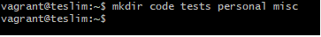

a. `Change directory to the tests directory using absolute pathname`

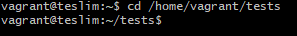

b. `Change directory to the tests directory using relative pathname`

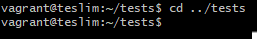

c. `Use echo command to create a file named fileA with text containing 'Hello A' in the misc directory`

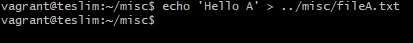

d. `create an empty file named fileB in the misc directory`

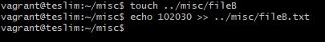

e. `copy contents Of fileA into fileC`

f. `move contents of fileB into fileD`

g. `create a tar archive called misc.tar for the contents of the misc directory`

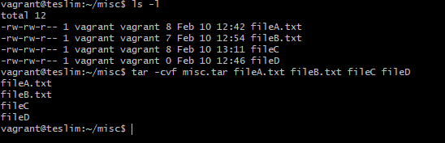

h. `compress the tar archive to create a misc.tar.gz file`

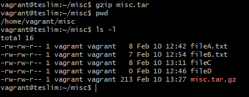

i. `create a user and force the user to change his/her password upon login`

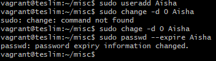

j. `lock a user's password`

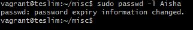

k. `create a user with no login shell`

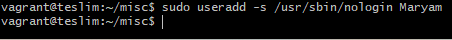

l. `disable password based authentication for ssh`

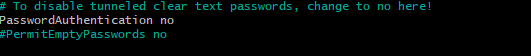

m. `disable root login`

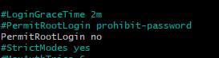

